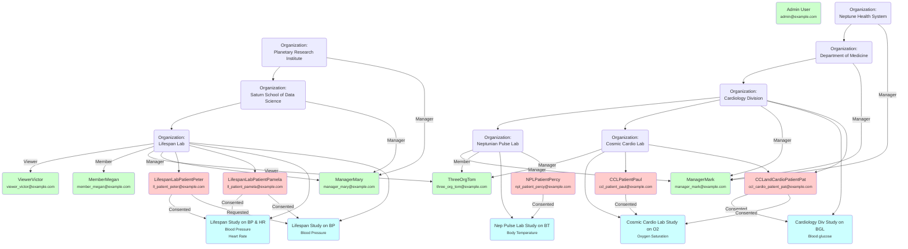

# JupyterHealth Seed Data Model ERD

```mermaid
flowchart TD
    %% node definitions
    admin_user("Admin User<br/><small>admin@example.com</small>")
    planetary_research_institute("Organization:<br/>Planetary Research Institute")
    saturn_school_of_data_science("Organization:<br/>Saturn School of Data Science")
    lifespan_lab("Organization:<br/>Lifespan Lab")
    viewer_victor("ViewerVictor<br/><small>viewer_victor@example.com</small>")
    member_megan("MemberMegan<br/><small>member_megan@example.com</small>")
    manager_mary("ManagerMary<br/><small>manager_mary@example.com</small>")
    three_org_tom("ThreeOrgTom<br/><small>three_org_tom@example.com</small>")
    lifespan_study_on_bp_hr("Lifespan Study on BP & HR<br/><small>Blood Pressure<br/>Heart Rate</small>")
    lifespan_study_on_bp("Lifespan Study on BP<br/><small>Blood Pressure</small>")
    lifespan_lab_patient_peter("LifespanLabPatientPeter<br/><small>ll_patient_peter@example.com</small>")
    lifespan_lab_patient_pamela("LifespanLabPatientPamela<br/><small>ll_patient_pamela@example.com</small>")
    neptune_health_system("Organization:<br/>Neptune Health System")
    department_of_medicine("Organization:<br/>Department of Medicine")
    cardiology_division("Organization:<br/>Cardiology Division")
    neptunian_pulse_lab("Organization:<br/>Neptunian Pulse Lab")
    cosmic_cardio_lab("Organization:<br/>Cosmic Cardio Lab")
    manager_mark("ManagerMark<br/><small>manager_mark@example.com</small>")
    cardiology_div_study_on_bgl("Cardiology Div Study on BGL<br/><small>Blood glucose</small>")
    nep_pulse_lab_study_on_bt("Nep Pulse Lab Study on BT<br/><small>Body Temperature</small>")
    cosmic_cardio_lab_study_on_o2("Cosmic Cardio Lab Study on O2<br/><small>Oxygen Saturation</small>")
    npl_patient_percy("NPLPatientPercy<br/><small>npl_patient_percy@example.com</small>")
    ccl_patient_paul("CCLPatientPaul<br/><small>ccl_patient_paul@example.com</small>")
    ccl_cardio_patient_pat("CCLandCardioPatientPat<br/><small>ccl_cardio_patient_pat@example.com</small>")

    %% styles
    style admin_user fill:#CFC
    style manager_mary fill:#CFC
    style member_megan fill:#CFC
    style viewer_victor fill:#CFC
    style three_org_tom fill:#CFC
    style manager_mark fill:#CFC
    style lifespan_study_on_bp_hr fill:#CFF
    style lifespan_study_on_bp fill:#CFF
    style cardiology_div_study_on_bgl fill:#CFF
    style nep_pulse_lab_study_on_bt fill:#CFF
    style cosmic_cardio_lab_study_on_o2 fill:#CFF
    style lifespan_lab_patient_peter fill:#FCC
    style lifespan_lab_patient_pamela fill:#FCC
    style npl_patient_percy fill:#FCC
    style ccl_patient_paul fill:#FCC
    style ccl_cardio_patient_pat fill:#FCC

    %% example institute org hierarchy
    planetary_research_institute --> saturn_school_of_data_science
    saturn_school_of_data_science --> lifespan_lab

    %% example institute user roles
    planetary_research_institute -- Manager --> manager_mary
    saturn_school_of_data_science -- Manager --> manager_mary
    lifespan_lab -- Viewer --> viewer_victor
    lifespan_lab -- Member --> member_megan
    lifespan_lab -- Viewer --> three_org_tom
    lifespan_lab -- Manager --> manager_mary

    %% example institute studies & patients
    lifespan_lab --> lifespan_lab_patient_peter
    lifespan_lab --> lifespan_lab_patient_pamela
    lifespan_lab --> lifespan_study_on_bp_hr
    lifespan_lab --> lifespan_study_on_bp
    lifespan_lab_patient_peter -- Consented --> lifespan_study_on_bp_hr
    lifespan_lab_patient_peter -- Requested --> lifespan_study_on_bp
    lifespan_lab_patient_pamela -- Consented --> lifespan_study_on_bp_hr
    lifespan_lab_patient_pamela -- Consented --> lifespan_study_on_bp

    %% Neptune Health System org hierarchy
    neptune_health_system --> department_of_medicine
    department_of_medicine --> cardiology_division
    cardiology_division --> neptunian_pulse_lab
    cardiology_division --> cosmic_cardio_lab

    %% Neptune Health System user roles
    neptune_health_system -- Manager --> manager_mark
    department_of_medicine -- Manager --> manager_mark
    cardiology_division -- Manager --> manager_mark
    neptunian_pulse_lab -- Manager --> manager_mark
    neptunian_pulse_lab -- Member --> three_org_tom
    cosmic_cardio_lab -- Manager --> three_org_tom

    %% Neptune Health System studies & patients
    cardiology_division --> cardiology_div_study_on_bgl
    neptunian_pulse_lab --> nep_pulse_lab_study_on_bt
    cosmic_cardio_lab --> cosmic_cardio_lab_study_on_o2
    neptunian_pulse_lab --> npl_patient_percy
    cosmic_cardio_lab --> ccl_patient_paul
    cardiology_division --> ccl_cardio_patient_pat
    cosmic_cardio_lab --> ccl_cardio_patient_pat
    npl_patient_percy -- Consented --> nep_pulse_lab_study_on_bt
    ccl_patient_paul -- Consented --> cosmic_cardio_lab_study_on_o2
    ccl_cardio_patient_pat -- Consented --> cardiology_div_study_on_bgl
    ccl_cardio_patient_pat -- Consented --> cosmic_cardio_lab_study_on_o2
```
